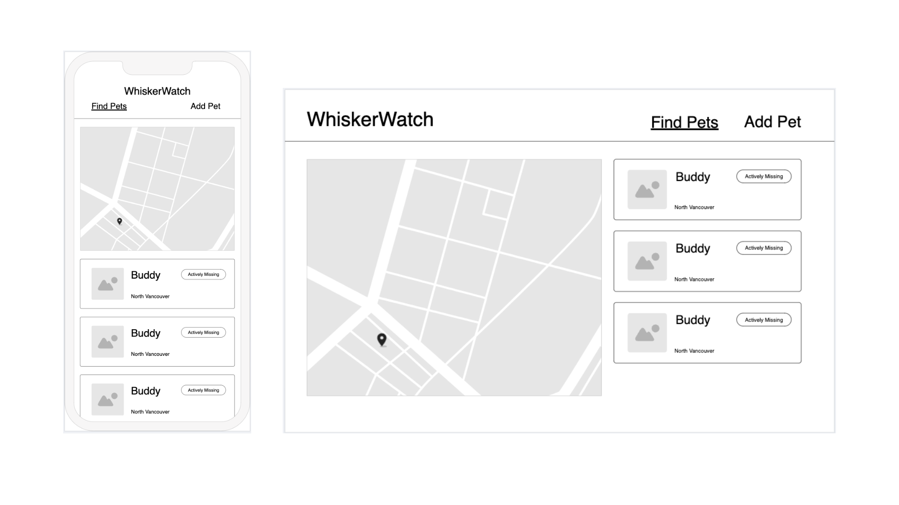
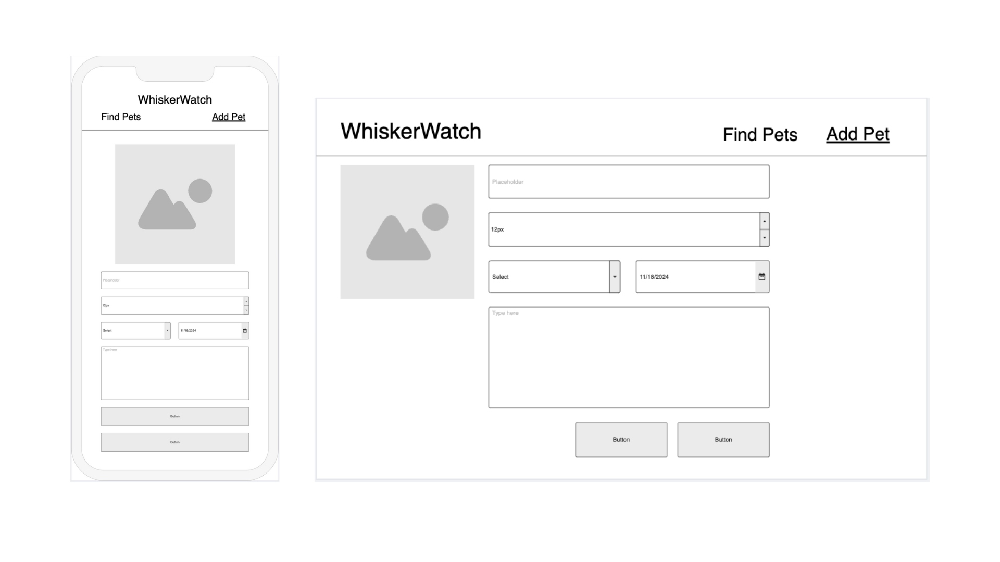
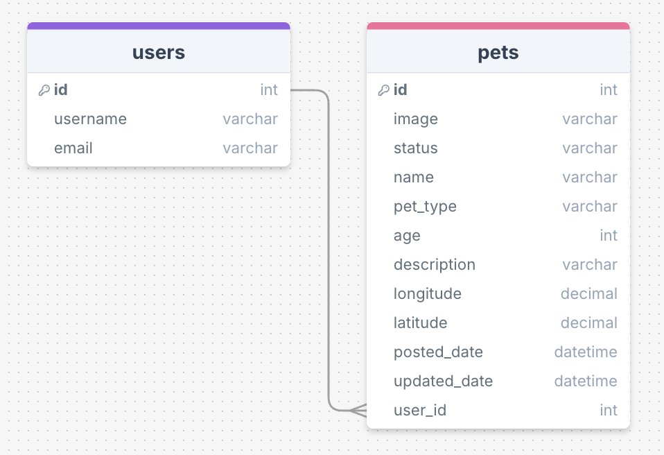
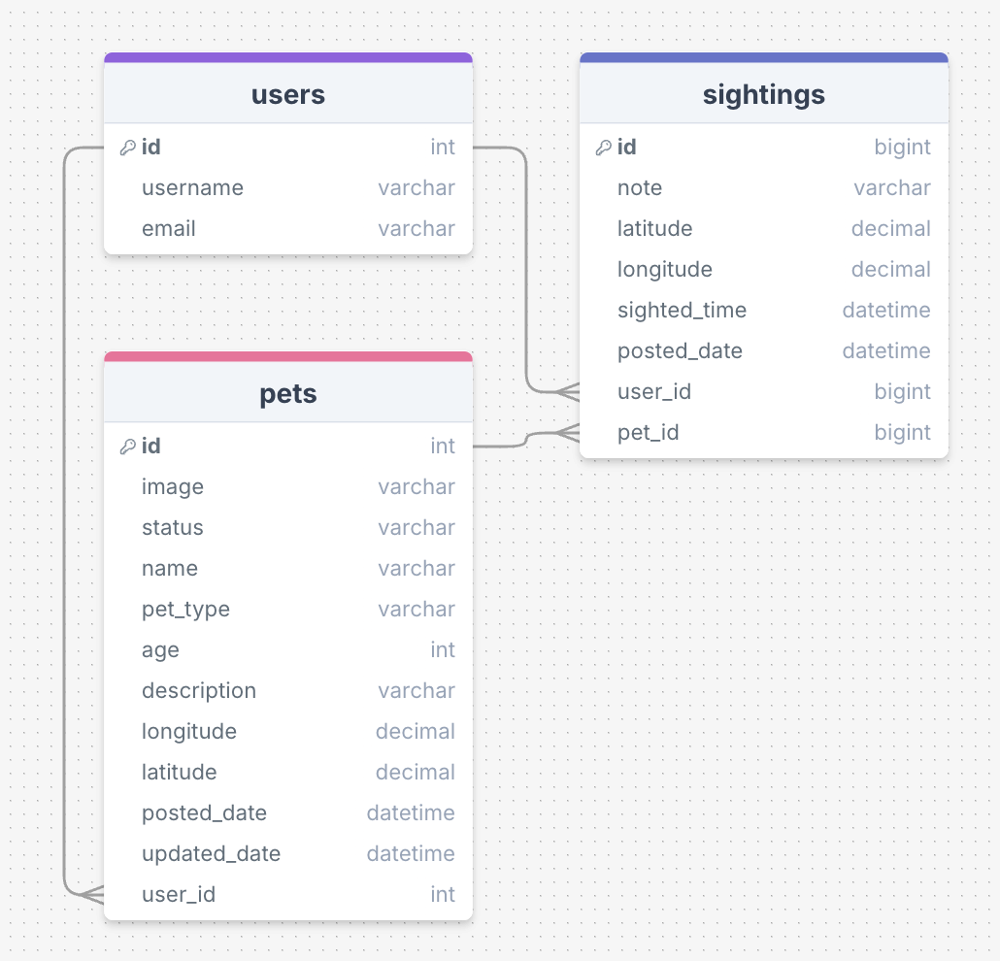
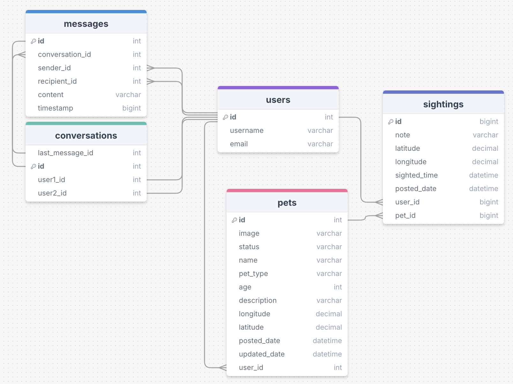

# WhiskerWatch

## Environement Setup

Google Maps API and Firebase Auth Accounts Required

1. Copy the `.env.example` file and rename it to `.env`
2. Fill in empty variables with your credentials for Google Maps API and Firebase Auth.
3. In your terminal, run `npm install` to install all dependencies
4. In your terminal run `npm run dev` and click on the provided url to see the website
5. To browse the site you can make your own account, or if you want to use a pre-made account that has some data attached to it you can sign into the developer profile:

- Email: developer@gmail.com
- Password: develop

## Overview

WhiskerWatch is a platform dedicated to reuniting lost pets with their owners.

### Problem Space

Losing a pet is a distressing experience, pet owners often feel helpless and desperate to find their pets as quickly as possible. Relying on posters or word of mouth can be inefficient and limit the reach of the message. WhiskerWatch will help pet owner's reach the right people at the right time and also will also serve as a database of lost pets that people can reference if they find a pet and want to find the owner.

### User Profile

**- Pet Owners:**

- who have lost a pet
- want to get the word out to as many people as possible
- want to make sure their message reaches the best audience (people in the location of where the pet was lost)

**- Community Members** (neighbors, good samaritans, animal lovers):

- who want to help people find their missing pets
- who should be aware if a pet is missing in their neighborhood so they can keep an eye out

### Features

- As a user, I want to be able to post that my pet is missing
- As a user, I want to be able to give relevant information (such as: location, picture, temperament) about my pet that will help others identify them and approach them safely
- As a user, I want to be able to provide my contact information to be able to be reached if someone finds my pet
- As a user, I want to be able to see missing pets that have been reported in my area
- As a user, I want to be able to report that I have seen a pet, where I saw it, and if I was unable to successfully approach and take in the pet
- As a logged in user, I want to be able to update the details of my lost pet listings or removing a pet listing

## Implementation

### Tech Stack

**MVP:**

Front-End:

- React
- Sass
- MUI - Custom Theming
- Google Maps API
- Geolocation API
- Firebase Authentication - Email/Password and Google OAuth

Back-End:

- Express Server
- Firebase Cloud Storage - User Uploaded Images
- Knex.js
- MySQL Database

### APIs

- Google Maps API: [Docs](https://developers.google.com/maps/documentation/javascript/overview)
- Geolocation API
- Firebase Auth API
- Firebase Storage API

### Sitemap

- Map & Pet List Page
- Pet Details Page
- Add Pet Page / Edit Pet Page
- Sign Up Page / Update Profile Page
- Login Page
- User Profile Page

### Mockups

**Pet List & Map Page**


**Pet Profile Page**


**Add Pet Page**


### Data

**MVP:**


**Future Implementations:**


**With Messaging System:**


### Endpoints

**MVP:**

**GET /pets**

- Get list of pets

Response:

```json
[
    {
        "id": 1,
        "image": "https://example.com/images/pet1.jpg",
        "status": "missing",
        "name": "Buddy",
        "pet_type": "dog",
        "age": 3,
        "description": "Golden retriever with a red collar, very friendly.",
        "longitude": -122.4194,
        "latitude": 37.7749,
        "posted_date": "2024-11-01T10:30:00Z",
        "updated_date": "2024-11-10T15:45:00Z",
        "user_id": 42
    },
    ...
]
```

**POST /pets**

- Add a new pet

Parameters:

- image, status, name, pet_type, age, description, longitude, latitude, user_id required in the request body

Request Body:

```json
{
  "image": "https://example.com/images/pet1.jpg",
  "status": "missing",
  "name": "Buddy",
  "pet_type": "dog",
  "age": 3,
  "description": "Golden retriever with a red collar, very friendly.",
  "longitude": -122.4194,
  "latitude": 37.7749,
  "user_id": 42
}
```

Response:

```json
{
  "id": 1,
  "image": "https://example.com/images/pet1.jpg",
  "status": "missing",
  "name": "Buddy",
  "pet_type": "dog",
  "age": 3,
  "description": "Golden retriever with a red collar, very friendly.",
  "longitude": -122.4194,
  "latitude": 37.7749,
  "posted_date": "2024-11-01T10:30:00Z",
  "updated_date": "2024-11-10T15:45:00Z",
  "user_id": 42
}
```

**GET /pets/:id**

- Get one pet with the given id

Parameters:

- id: number representing the id of the pet

Response:

```json
{
  "id": 1,
  "image": "https://example.com/images/pet1.jpg",
  "status": "missing",
  "name": "Buddy",
  "pet_type": "dog",
  "age": 3,
  "description": "Golden retriever with a red collar, very friendly.",
  "longitude": -122.4194,
  "latitude": 37.7749,
  "posted_date": "2024-11-01T10:30:00Z",
  "updated_date": "2024-11-10T15:45:00Z",
  "user_id": 42
}
```

**Future Implementations:**

- PUT /pets/:id
- DELETE /pets/:id

- GET /pets/:id/sightings
- POST /pets/:id/sightings

- POST /users/register
- POST /users/login

- GET /users/:id/conversations
- POST /users/:id/conversations
- DELETE /users/:id/conversations
- GET /conversations/:id/messages
- POST /conversations/:id/messages

## Roadmap

- Create client

  - React project with routes and boilerplate pages

- Create server
  - Express project with routing, with placeholder 200 responses
- Create migrations
- Create mock data
- Create seeds with mock data
- Deploy client and server projects so all commits will be reflected in production

- Feature: List Lost Pets in a Given Location

  - Build and style
  - Fetch and display a list of pets given a certain location
  - Create GET /pets endpoint

- Feature: Dynamic/Interactive Map of Lost Pets in a Given Location

  - Build and style
  - Integrate Google Maps API to display the list of lost pets in a given location on the map

- Feature: Pet Profile Page

  - Build and style
  - Get a pet by id and display all relevant data
  - Create GET /pets/:id endpoint

- Feature: Add Pet Page

  - Build and style
  - Create POST /pets endpoint

- Feature: Pet Sightings

  - Build and style component, implement into pet profile page
  - Create GET /pets/:id/sightings endpoint
  - Create add sighting form
  - Create POST /pets/:id/sightings endpoint

- Feature: User Authentication - Sign Up Page

  - Build and style
  - Implement Firebase Authentication

- Feature: User Authentication - Login Page

  - Build and style
  - Implement Firebase Authentication

- Feature: Account Page

  - Build and style
  - Create PUT /pets/:id endpoint
  - Create DELETE /pets/:id endpoint

- Feature: Messaging System DB

  - Add conversations and messages tables
  - Seed with mock data

- Feature: Inbox Page
  - Build and style
  - New conversation form
  - Create GET /users/:id/conversations endpoint
  - Create POST /users/:id/conversations endpoint
  - Create DELETE /users/:id/conversations endpoint
  - Create GET /conversations/:id/messages endpoint
  - Create POST /conversations/:id/messages endpoint

---

## Future Implementations

I have broken up the above sections based on MVP and plans for future implementations.

A summary would be that I plan to add a "sightings" feature where users can report a sighting of a pet if they happened to see it but were unable to approach/take in the pet. These sightings would be visble on a pet's profile page.

Additionally, I would like to implement user authentication and a messaging system for users to be able to message each other within the app.

I would also like to eventually convert this project to be built in some high-demand technologies in the industry such as TypeScript and Next.js.

Another feature that I think would be a valuable addition to this app would be a notification system where users could opt in to recieve email notifcations for various events. For example, recieving a message, new animal reported lost in your area, a sighting was left on your lost pet, etc.
